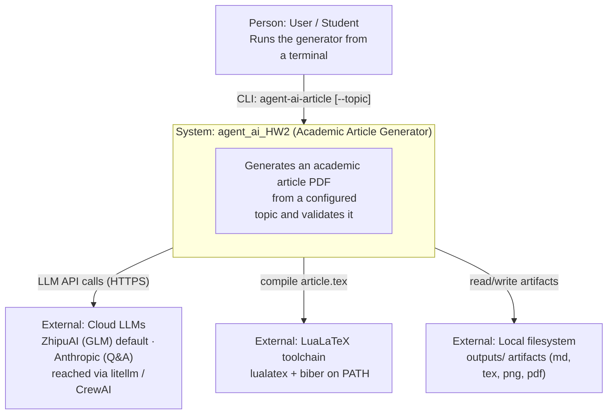
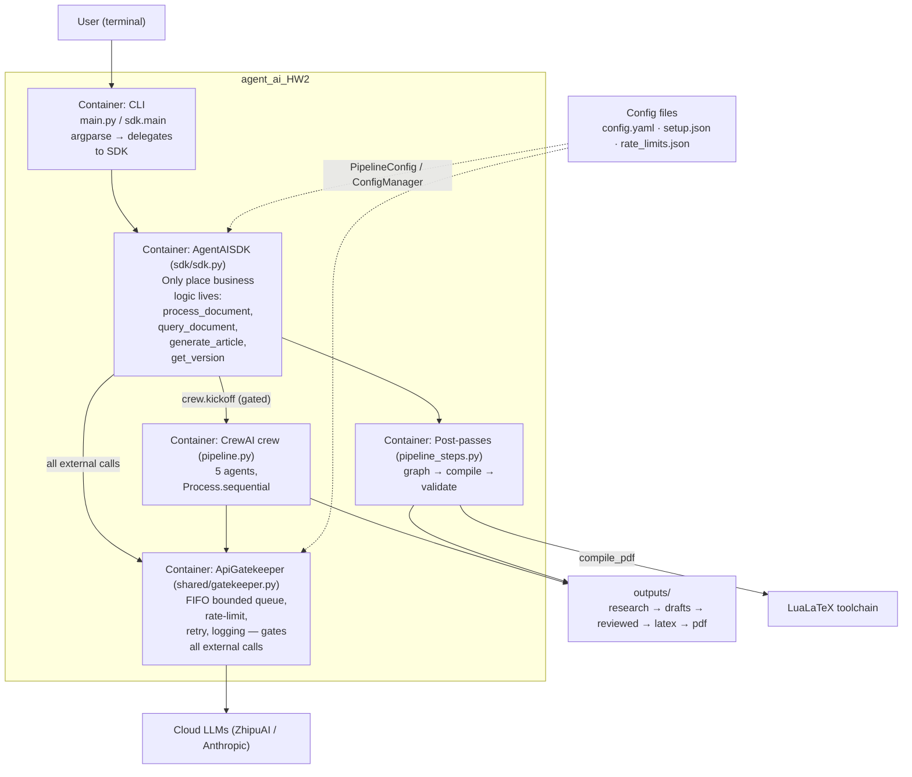
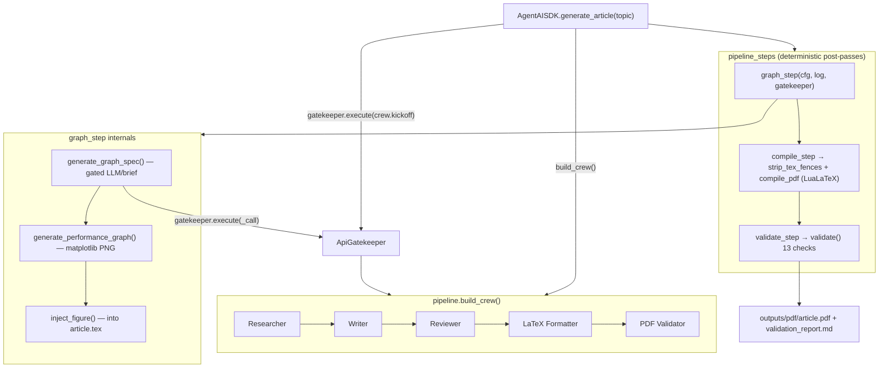
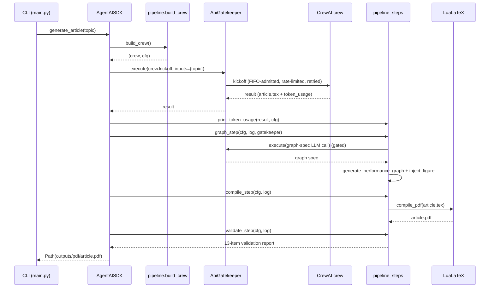

# Architecture — agent_ai_HW2

This document describes the architecture of the Academic Article Generator using
the [C4 model](https://c4model.com) (Context → Container → Component), a runtime
sequence diagram, Architecture Decision Records (ADRs), and the public interface
contracts. All diagrams are authored in Mermaid.

Related docs: [PLAN.md](PLAN.md) (directory layout, validation requirements) and
[PRD.md](PRD.md) (functional/non-functional requirements).

---

## 1. C4 — Level 1: System Context

The user drives the system from a CLI. The Agent-AI system reaches three kinds of
external systems: cloud LLMs (ZhipuAI/GLM by default, Anthropic for document
Q&A) via litellm/CrewAI, the local LuaLaTeX toolchain for PDF compilation, and
the local filesystem for outputs.

---

## 2. C4 — Level 2: Container

Inside the system: the CLI delegates to the SDK; every external LLM call is
funneled through the `ApiGatekeeper`; the CrewAI crew produces the LaTeX, and the
deterministic post-passes finish the figure, PDF, and validation. Config files
and `outputs/` are passive data stores.

---

## 3. C4 — Level 3: Component (SDK + Pipeline)

Zooming into `generate_article`: `build_crew` wires five agents through
`Process.sequential`; the post-passes run in order; `graph_step` orchestrates the
graph spec (gated), the matplotlib figure, and figure injection.

Stage outputs (each task feeds the next via `Process.sequential`):

| Agent | Output artifact |
|-------|-----------------|
| Researcher | `outputs/research/research_brief.md` |
| Writer | `outputs/drafts/article_draft.md` |
| Reviewer | `outputs/reviewed/reviewed_article.md` |
| LaTeX Formatter | `outputs/latex/article.tex` |
| PDF Validator | `outputs/pdf/validation_report.md` |

---

## 4. Sequence — `generate_article`

---

## 5. Architecture Decision Records (ADRs)

### ADR-001 — All business logic behind the SDK layer
- **Context.** The project must support a CLI today and possibly a GUI/third-party
  consumer later, without duplicating or scattering logic.
- **Decision.** `AgentAISDK` (`src/sdk/sdk.py`) is the single entry point. The CLI
  wrappers (`src/main.py`, `sdk.main`) only parse arguments and delegate; they
  contain no business logic.
- **Consequences.** One place to test and evolve behavior; consumers share an
  identical contract. CLI/GUI stay thin. Anything bypassing the SDK is a defect.

### ADR-002 — A single central `ApiGatekeeper` for every external API call
- **Context.** External LLM calls must be rate-limited, retried, queued, and
  logged uniformly; ad-hoc handling per call site is error-prone.
- **Decision.** All external API calls pass through one `ApiGatekeeper`
  (`src/shared/gatekeeper.py`). It enforces FIFO admission, per-minute/hour rate
  windows, a concurrency semaphore, bounded queuing, retries, and logging. The
  crew run and the graph-spec LLM call both route through it.
- **Consequences.** Consistent rate-limit/retry/observability behavior; a single
  choke point and audit log. CrewAI manages its own per-call LLM traffic
  internally, so the crew is gated as one unit rather than per sub-call.

### ADR-003 — LLM provider is ZhipuAI (GLM) via litellm/CrewAI
- **Context.** The original PRD/PLAN (F-08, §4) specified a local Ollama model
  (`qwen3:14b` on `http://localhost:11434`) with no cloud key. In practice the
  pipeline is run against a hosted GLM endpoint.
- **Decision.** The configured provider is ZhipuAI (GLM) via litellm/CrewAI, set
  in `config/config.yaml` (`llm.provider: zhipuai`, `model: glm-4.7-flashx`,
  `base_url: https://api.z.ai/api/paas/v4/`). The key is supplied via
  `ZHIPUAI_API_KEY`. This **supersedes** the earlier Ollama-local plan. Ollama
  remains a selectable provider in `PipelineConfig.build_llm()` for local use.
- **Consequences.** No local GPU/Ollama server required for article generation; a
  `ZHIPUAI_API_KEY` is now needed. Provider/model/base-url stay config-driven, so
  switching back to Ollama (or to another provider) is a config change. The
  Anthropic key is still used only for the document-Q&A path.

### ADR-004 — Deterministic post-passes run after the agent crew
- **Context.** Figure generation, LaTeX repair, and the assignment checklist must
  be reproducible — not left to the non-deterministic LLM crew.
- **Decision.** After `crew.kickoff`, three deterministic passes run in order
  (`src/pipeline_steps.py`): `graph_step` (graph spec → matplotlib figure →
  inject), `compile_step` (fence-strip + LuaLaTeX), `validate_step` (13-point
  checklist). Only the graph **spec** consults the LLM, and that call is gated.
- **Consequences.** The figure, the compiled PDF, and the validation result are
  reproducible and independent of LLM variance. The crew focuses on producing
  `article.tex`; correctness gates live in code, not prompts.

### ADR-005 — Config-driven rate limits with a bounded FIFO queue
- **Context.** Under burst load the system must not drop requests or crash, and
  limits must never be hard-coded.
- **Decision.** Rate limits, queue capacity (`queue_maxsize`), and window spans
  (`minute_window_seconds`, `hour_window_seconds`) come from
  `config/rate_limits.json` (per service). The gatekeeper uses a bounded FIFO
  `queue.Queue`; `put()` blocks (backpressure) when full instead of dropping, and
  a monotonic ticket guarantees strict FIFO ordering.
- **Consequences.** Predictable, fair behavior under overload with no drops or
  crashes; limits are tuned via config without code changes. Sustained overload
  surfaces as slower admission (backpressure), which is the intended trade-off.

---

## 6. Interface Contracts

### 6.1 `AgentAISDK` public API (`src/sdk/sdk.py`)

| Method | Inputs | Output | Raises |
|--------|--------|--------|--------|
| `process_document(file_path)` | `file_path: str \| Path` — a supported document | `str` — extracted Markdown | `FileNotFoundError` if the path does not exist |
| `query_document(markdown_text, question)` | `markdown_text: str`, `question: str` | `str` — Claude's answer | `OSError` if `ANTHROPIC_API_KEY` is unset; `RuntimeError` if the gated call exhausts retries |
| `generate_article(topic=None)` | `topic: str \| None` — defaults to `config.yaml::article.topic` | `Path` — `outputs/pdf/article.pdf` | `RuntimeError` if the gated crew run exhausts retries; provider key required per `config.yaml` |
| `get_version()` | — | `str` — SDK version (`VERSION`) | — |

Construction: `AgentAISDK(config_dir: Path | None = None)`. The Anthropic client
is created lazily, so `process_document` / `get_version` work without an
Anthropic key. The gatekeeper is built from the `anthropic` rate-limit block in
`config/rate_limits.json`.

### 6.2 `ApiGatekeeper` contract (`src/shared/gatekeeper.py`)

- **`execute(api_call, *args, **kwargs) -> Any`** — Admits the call in strict FIFO
  order (monotonic ticket), bounds load via a `maxsize` queue (`put()` blocks
  under overload; never drops), waits for the per-minute and per-hour rate
  windows, acquires the concurrency semaphore, then runs `api_call`. Retries on
  any `Exception` up to `max_retries`, sleeping `retry_after_seconds` between
  attempts. **Returns** the call's result on success; **raises** `RuntimeError`
  (chained from the last exception) after retries are exhausted.
- **`get_queue_status() -> QueueStatus`** — Returns a snapshot
  `QueueStatus(depth, processed_total, failed_total)`: current queue depth, the
  cumulative count of successful calls, and the cumulative count of permanently
  failed calls.
- **Config.** Constructed with `RateLimitConfig(requests_per_minute,
  requests_per_hour, concurrent_max, retry_after_seconds, max_retries,
  queue_maxsize=500, minute_window_seconds=60, hour_window_seconds=3600)`, all
  sourced from `config/rate_limits.json`.

---

## 7. Deployment / Runtime

- **Runtime.** Python 3.10+ (repo pins 3.12 via `.python-version`); managed with
  the `uv` package manager (`uv sync --extra dev`, run via `uv run`).
- **Environment variables.** `ZHIPUAI_API_KEY` for article generation (default
  provider); `ANTHROPIC_API_KEY` for the document-Q&A path. Provider, model, and
  base URL are set in `config/config.yaml`.
- **External toolchain.** A LuaLaTeX toolchain (`lualatex`, with `biber`) must be
  on `PATH`, including Hebrew font support for the bilingual section.
- **Outputs.** All artifacts are written under `outputs/`
  (`research → drafts → reviewed → latex → pdf`, plus `assets/`); the final
  deliverables are `outputs/pdf/article.pdf` and `outputs/pdf/validation_report.md`.
- **Entry points.** `agent-ai-article [--topic "..."]` (article generation) and
  `agent-ai <file> "<question>"` (document Q&A).
