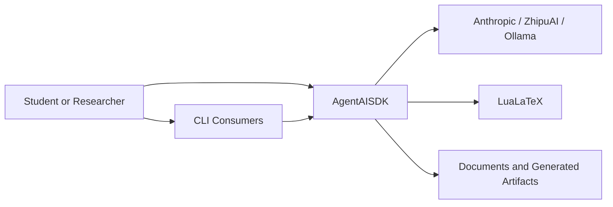
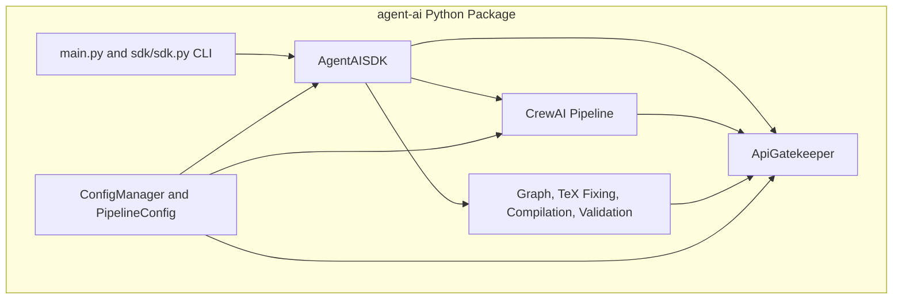
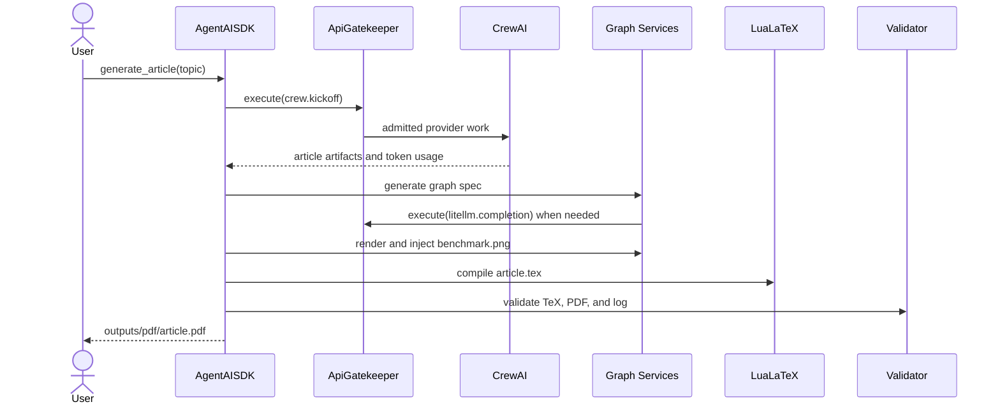
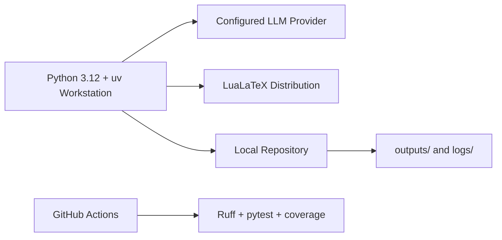

# Architecture and Planning - agent_ai_HW2

## 1. Architecture Goals

- Keep `AgentAISDK` as the only public business-logic entry point.
- Keep external LLM traffic behind one configured gatekeeper abstraction.
- Separate agent orchestration, deterministic post-processing, and infrastructure.
- Make every component testable without real network or LaTeX dependencies.

## 2. C4 Context

## 3. C4 Containers

## 4. Component Model

| Component | Responsibility | Main Interface |
|---|---|---|
| `sdk/sdk.py` | Public workflows and CLI delegation | `AgentAISDK` |
| `shared/gatekeeper.py` | FIFO queue, limits, concurrency, retries, metrics | `execute()`, `get_queue_status()` |
| `pipeline.py` | Build five agents and five sequential tasks | `build_crew()` |
| `agents/factory.py` | Construct agents from `skills/*/SKILL.md` | `build_agent()` |
| `tasks/*.py` | Define stage prompts, context, and output contracts | `build_*_task()` |
| `pipeline_steps.py` | Orchestrate graph, compilation, and validation | `graph_step()`, `compile_step()`, `validate_step()` |
| `utils/graph_*` | Resolve graph data, render PNG, inject LaTeX | `generate_graph_spec()`, `generate_performance_graph()` |
| `utils/pdf_compiler.py` | Execute LuaLaTeX and return structured status | `compile_pdf()` |
| `utils/tex_validator.py` | Produce the 13-check validation report | `validate()` |

## 5. Article Sequence

## 6. Deployment

Production deployment is a local CLI/package installation. There is no server process. Provider credentials are environment variables and generated files stay under configured output directories.

## 7. Interface Contracts

### `AgentAISDK.generate_article(topic)`

- Input: optional topic string.
- Output: `Path` to `article.pdf`.
- Failure: provider, graph, or compilation exceptions are logged; compilation returns structured status.

### `ApiGatekeeper.execute(callable, *args, **kwargs)`

- Input: callable and arguments.
- Behavior: bounded FIFO admission, configured rate windows, semaphore concurrency, configured retry count.
- Output: callable result.
- Failure: raises `RuntimeError` after configured retries.

### `generate_graph_spec(brief_path, cfg, spec_out, gatekeeper)`

- Input: research brief and pipeline configuration.
- Output: normalized `main`, `arch_a`, and `arch_b` mapping.
- Fallback: embedded JSON, gated LLM request, then deterministic defaults.

## 8. Architecture Decision Records

### ADR-001: SDK as the public boundary

**Decision:** CLI consumers call `AgentAISDK`; internal modules are implementation details.
**Rationale:** one stable contract prevents business logic from spreading across interfaces.
**Trade-off:** the SDK coordinates several services and must remain thin.

### ADR-002: Configured provider abstraction

**Decision:** provider/model/base URL live in `config/config.yaml`.
**Rationale:** ZhipuAI, Anthropic, OpenAI-compatible providers, and Ollama can be selected without source edits.
**Trade-off:** provider capability differences require small adapter branches.

### ADR-003: Central FIFO API gatekeeper

**Decision:** network-producing workflows use a bounded FIFO gatekeeper.
**Rationale:** enforce rate limits, retries, backpressure, concurrency, and monitoring consistently.
**Trade-off:** synchronous admission can increase latency under load.

### ADR-004: Deterministic post-processing

**Decision:** graph rendering, TeX repair, compilation, and validation are Python utilities after the agent stages.
**Rationale:** deterministic operations are easier to test and more reliable than prompt-only formatting.
**Trade-off:** generated agent output must satisfy utility input contracts.

### ADR-005: Full-tree coverage enforcement

**Decision:** coverage includes all modules under `src/` and branch coverage.
**Rationale:** orchestration and infrastructure are critical behavior, not acceptable exclusions.
**Trade-off:** tests use dependency isolation and mocks to avoid paid APIs and local toolchain dependence.

## 9. Extension Points

- Add a provider branch in `PipelineConfig.build_llm()` and `graph_spec_parse.llm_params()`.
- Add a new agent skill and task builder, then wire it in `pipeline.build_crew()`.
- Add validator checks as independent `CheckResult` producers.
- Replace the graph renderer while preserving the normalized graph-spec contract.
- Add new CLI or REST consumers by calling `AgentAISDK`, not internal modules.

## 10. Quality and Security

- CI runs Ruff and pytest with an 85% full-source branch-coverage threshold.
- Secrets are environment-only and `.env` is ignored.
- Rate limits and queue settings are versioned configuration.
- Tests mock external services and do not require network access.
- Design targets ISO/IEC 25010 maintainability, reliability, security, portability, and usability characteristics.
