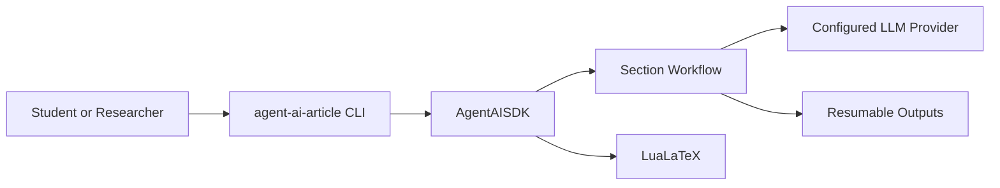
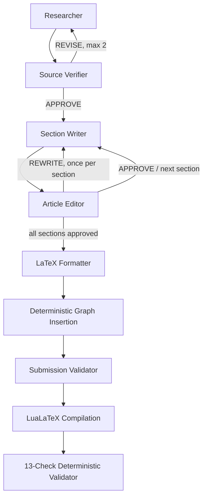

# Architecture and Planning - agent_ai_HW2

## Architecture Goals

- Keep `AgentAISDK` as the public boundary.
- Gate every provider call through `ApiGatekeeper`.
- Persist planning, approvals, counters, and failure reasons.
- Separate agent judgment from deterministic rendering, compilation, and validation.

## Context



## Six-Agent Workflow



The total Article Editor rejection budget is `ceil(section_count * 0.33)`.
Submission Validator findings are advisory and never stop the workflow or create a third
feedback loop. Compilation and deterministic processing errors remain execution failures.

## Components

| Component | Responsibility |
|---|---|
| `pipeline.py` | Build configured workflow and stage runner |
| `workflow/orchestrator.py` | State transitions, resume, formatting, advisory evaluation |
| `workflow/research_loop.py` | Researcher-Verifier bounded loop |
| `workflow/section_loop.py` | Writer-Editor bounded loop |
| `workflow/models.py` | Section and run-state contracts |
| `workflow/storage.py` | Planning, section, assembly, and state persistence |
| `workflow/parsing.py` | JSON, visual provenance, and BiDi validation |
| `pipeline_steps.py` | Graph insertion, compilation, deterministic validation |

## Persistence

```text
outputs/
  planning/          research, outline, sources, verification
  sections/          specification, draft, review, approved section
  assets/            approved visual specs and generated assets
  assembled/         approved Markdown article
  latex/             article.tex and benchmark.png
  pdf/               article.pdf and validation reports
  run_state.json
```

The topic, phase, research return count, approved sections, per-section returns,
article-wide rejection usage, current section, and failure reason are persisted.

Approved plans must end with a complete References/Bibliography section and meet the
configured body-word target. The final deterministic compilation check also verifies the
configured minimum PDF page count.

At least three sourced academic visuals are required by default. Planning links each chart,
table, or diagram to a body section, and deterministic validation counts rendered visual
containers in the final LaTeX.

## Academic Visuals

Researcher defines purpose, data, placement, and sources. Source Verifier approves
provenance. Writer places the artifact in the assigned section. Article Editor checks
relevance. Python renders quantitative charts. LaTeX Formatter handles tables, formulas,
TikZ, captions, and labels. Submission Validator inspects the final result.

## Hebrew-English BiDi

The outline must include `Hebrew and English in AI Systems`. The Writer supplies substantive
Hebrew with natural English technical terms. The Formatter uses `polyglossia`,
`hebrew` environments, and `\textenglish`. Deterministic validation rejects leaked Hebrew,
unwrapped core technical terms, `\setRL`, and Unicode direction controls.

## Decisions

- **Explicit orchestration over hierarchical CrewAI:** loop budgets and resume behavior are
  deterministic and testable.
- **One-agent Crew stages:** each provider call is independently rate-limited and retried.
- **Approved sections are immutable inputs to formatting:** the Formatter may format but not
  invent or factually rewrite content.
- **Advisory submission evaluation:** the agent reports quality without changing workflow
  status; compilation and structural checks remain deterministic execution stages.

## Quality

CI runs Ruff and full-source branch coverage with an 85% threshold. Tests mock provider
calls, exercise both loops, validate resume behavior, and verify visual and BiDi contracts.
