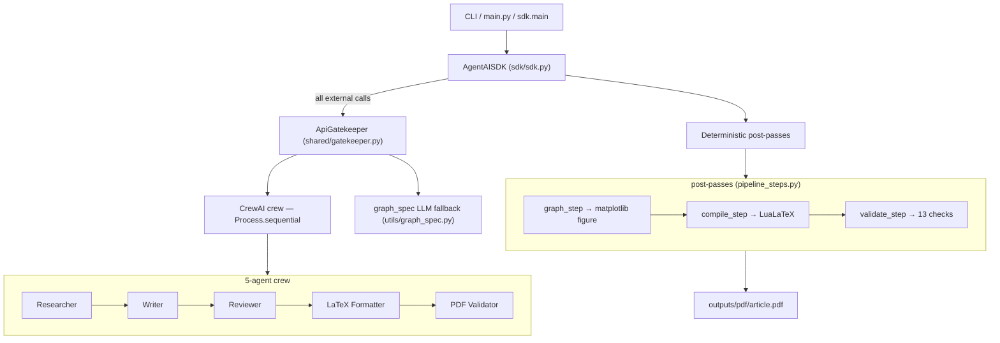

# Architecture & Planning Document — agent_ai_HW2

## 1. Current Architecture

The project now has two surfaces:

- Top-level `src/sdk.py` keeps the existing document conversion and Claude Q&A SDK.
- Top-level `src/main.py` runs the CrewAI article generator for "Multi-Agent Collaboration Systems: Designing Teams of AI Agents".

The article pipeline intentionally works without RAG for now.

### 1.1 Architecture Diagram

All consumers enter through the SDK, and every external LLM call is routed through
the central `ApiGatekeeper` (rate-limit, queue, retry, logging).



See [docs/ARCHITECTURE.md](ARCHITECTURE.md) for C4 diagrams, ADRs, and interface contracts.

## 2. Article Pipeline

```
Researcher Agent
  -> outputs/research/research_brief.md
Writer Agent
  -> outputs/drafts/article_draft.md
Reviewer Agent
  -> outputs/reviewed/reviewed_article.md
LaTeX Formatter Agent
  -> outputs/latex/article.tex
PDF Validator Agent
  -> outputs/pdf/validation_report.md
```

The crew runs with `Process.sequential`, so each task receives the previous task output as context.

## 3. RAG Status

RAG is not part of the current implementation plan.

- Do not create `rag/indexer.py` yet.
- Do not create `rag/retriever.py` yet.
- The Researcher gathers and summarizes information directly.
- The Writer uses the Researcher output as context.
- A future RAG stage can be inserted between Researcher and Writer.

## 4. Local LLM

CrewAI uses local Ollama when configured:

- Default model: `qwen3:14b`
- Default base URL: `http://localhost:11434`
- Environment overrides: `OLLAMA_MODEL`, `OLLAMA_BASE_URL`, `USE_OLLAMA`

## 5. Directory Layout

This tree mirrors the actual `src/` module layout (verified against
`find src -type f -name '*.py'`). A one-line purpose note accompanies each
top-level package.

```
src/
  main.py               # CLI entry → AgentAISDK.generate_article (thin wrapper)
  pipeline.py           # build_crew(): assembles the 5-agent sequential Crew
  pipeline_steps.py     # deterministic post-passes: graph → compile → validate
  constants.py          # shared literals/paths used across modules

  agents/               # CrewAI agent construction
    factory.py          #   build_agent(skill_name, llm) — one parametrised factory

  sdk/                  # public SDK layer (the only allowed entry point)
    sdk.py              #   AgentAISDK: process/query document, generate_article, get_version

  shared/               # cross-cutting infrastructure
    config.py           #   ConfigManager / AppConfig (setup.json, rate_limits.json)
    gatekeeper.py       #   ApiGatekeeper — FIFO bounded queue, rate-limit, retry
    pipeline_config.py  #   PipelineConfig — typed view of config.yaml
    version.py          #   VERSION + config-version validation

  tasks/                # CrewAI task builders (one per crew stage)
    research_task.py
    writing_task.py
    review_task.py
    latex_task.py
    validation_task.py

  utils/                # deterministic helpers (figures, LaTeX, validation, IO)
    compile_result.py   #   CompileResult dataclass for the PDF compiler
    figure_inject.py    #   build + inject the benchmark figure into article.tex
    file_utils.py       #   ensure_output_dirs and filesystem helpers
    graph_fallback.py   #   default graph spec when no data is available
    graph_generator.py  #   matplotlib 2-panel benchmark PNG
    graph_spec.py       #   LLM-driven graph spec (gated through the gatekeeper)
    graph_spec_parse.py #   parse/validate/normalise the graph spec JSON
    logger.py           #   configure_logger, timed_stage, get_logger
    pdf_compiler.py     #   LuaLaTeX + biber compile pipeline
    skill_loader.py     #   load SKILL.md → Skill (role/description/body)
    tex_fixer.py        #   strip code fences / repair stray LaTeX
    tex_hebrew.py       #   Hebrew / BiDi LaTeX handling
    tex_protected.py    #   protect verbatim/sensitive spans during fixes
    tex_syntax.py       #   low-level LaTeX syntax repairs
    tex_tables.py       #   table normalisation
    tex_tikz.py         #   TikZ figure handling
    tex_validator.py    #   validate(): the 13-item assignment checklist
    validator_checks.py #   individual checklist check implementations
    validator_types.py  #   ValidationReport / Check dataclasses

outputs/                # generated artifacts (created at runtime)
  research/   drafts/   reviewed/   latex/   pdf/   assets/
```

## 6. Validation Requirements

The PDF Validator checks for:

- cover page
- table of contents
- chapters/sections
- headers/footers
- at least one image placeholder
- at least one Python-generated graph placeholder
- at least one table
- at least one mathematical formula
- Hebrew-English BiDi section
- bibliography
